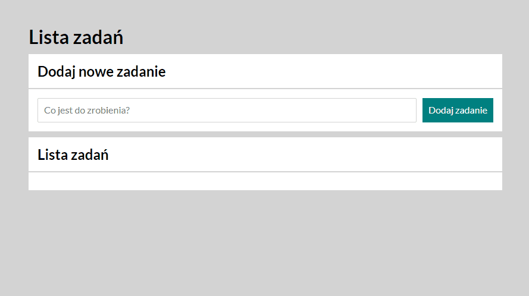

# The ToDo List

Are you tired looking for your notebook? Your pen doesn't work again? You've got a headache from remembering too many things?

Introducing:

### ✨ The ToDo List ✨

_The perfect task storage until you refresh the page_

## How to use

1. Type your task in the only possible text input below "Dodaj nowe zadanie" header
2. Press Enter or click on the teal button on the right
3. Your task should appear in the list below.
4. You can select finished task by pressing green button on the left of the list
   - Finished tasks are marked with a "✓" and the text will appear with the line-through style
5. To delete unwanted tasks press red button on the right
   - Task doesn't have to be finished to be removable from the list

### Gif for non-enligsh people

## Links

[The ToDo List](https://oko147.github.io/todo-list)

## Languages used

- HTML
- CSS
- JavaScript
